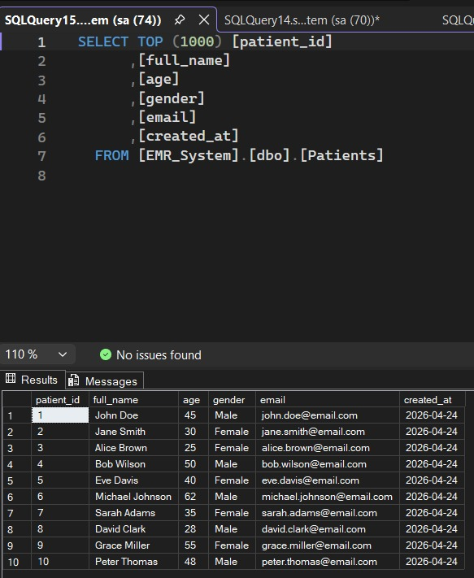
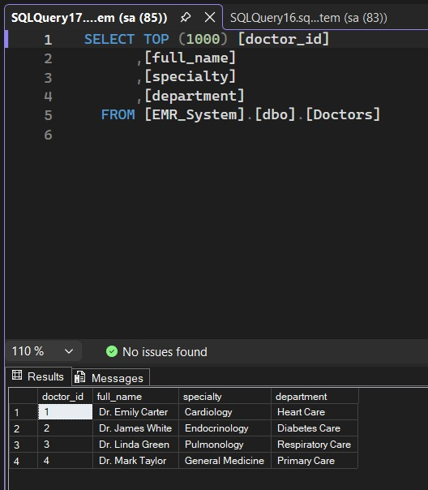
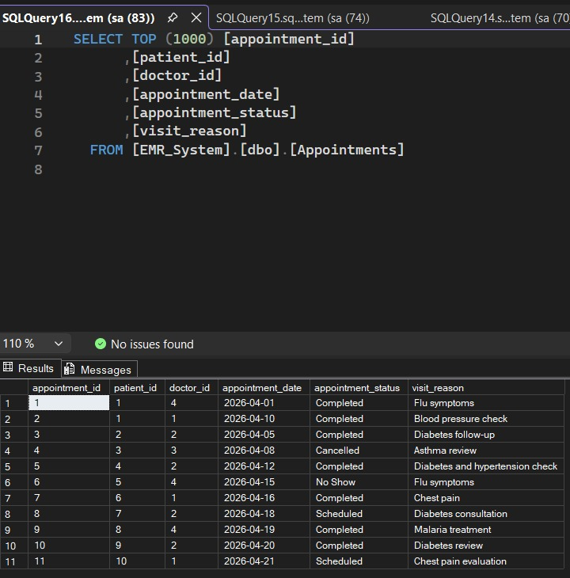
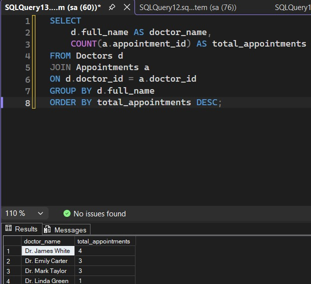
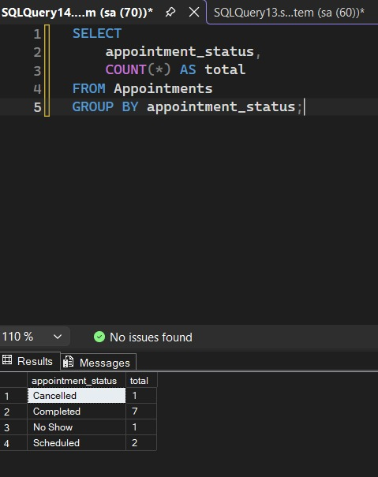
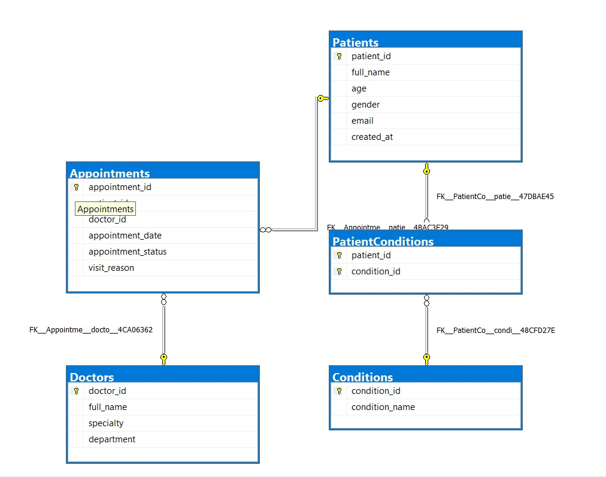

# EMR Patient Care Analytics Database
## 📌 Overview
This project is a simplified Electronic Medical Record (EMR) system built using SQL Server. It manages patients, doctors, medical conditions, and appointments.

## 🎯 Objective
To design a structured healthcare database and generate meaningful insights using SQL queries.

## 🗂️ Database Structure
- Patients
- Doctors
- Conditions
- PatientConditions
- Appointments

## 🧠 Key Features
- Normalized relational database design
- Many-to-many relationship between patients and conditions
- Real-world healthcare data modeling
- Analytical SQL queries for insights

## 📊 Analytics Performed
- Patient condition distribution
- Doctor workload analysis
- Appointment status tracking
- Missed and cancelled appointment analysis

## 🛠️ Tools Used
- Database: SQL Server (T-SQL)
- Interface: SQL Server Management Studio (SSMS)

## 🚀 How to Use
1. Clone the repository.
2. Run the`emr_database.sql` script in SSMS to create the tables.
3. Execute the scripts to generate the analytics reports.

## 📷 Sample Output

### Patients Table

### Doctors Table

### Appointments Table

### Doctor Workload Analysis

### Appointment Status Summary
"

## 🧩 ER Diagram

## 📊 Key Insights
- Dr. James White has the highest number of appointments, indicating high workload in the Endocrinology department.
- Most appointments are marked as "Completed", showing good patient follow-through.
- A few "No Show" and "Cancelled" appointments indicate potential inefficiencies in scheduling.

## ✍️ Author: [Kehinde Onifade](https://github.com/KennyOnifade)
